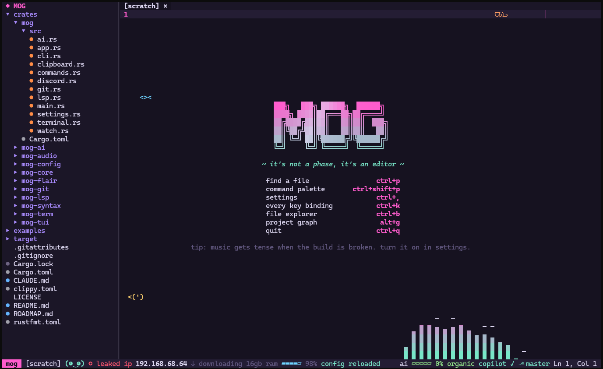

# mog

**A terminal code editor that mogs other editors.**



Normal keybindings. Full mouse support. Language servers, Claude and Copilot built in. Also a
tiny face that judges your compile errors, critters living in your whitespace, and chiptune
music that gets tense when the build breaks.

It's a joke. It's also a real editor you can get work done in.

```sh
mog .
```

## What's in it

**The editor**

- Modeless editing with the keys you already know, and a mouse that works like VS Code
  (drag select, double and triple click, right click menus)
- Tabs, splits, multiple cursors, find and replace, a built in terminal
- File explorer, fuzzy finder, command palette and a key list you can rebind from
- Tree-sitter highlighting for twelve languages
- LSP: diagnostics with error lens, completion, hover, go to definition, references, rename,
  formatting, code actions
- Git gutter, branch in the status line, file colors and inline blame
- Claude chat, explain selection and ghost text. Copilot ghost text.
- Seven themes and a settings menu that writes to your config

**The rest**

- An Obsidian style graph of your project
- An AI meter that guesses how AI generated your file is
- Your LAN IP, displayed like it got leaked
- The mogling, a little face with feelings about your errors
- A combo counter with sparks flying off the cursor
- Aura points, a RAM download and an FBI agent counter
- Matrix rain when you go idle
- Sound effects, music and spectrum bars for whatever your computer is playing
- Discord Rich Presence

All of it can be switched off.

## Install

Grab a build for Windows, macOS or Linux from
[releases](https://github.com/SpideyZac/mog/releases), unpack it and put `mog` somewhere on your
`PATH`.

### Building it yourself

You need stable Rust (edition 2024, so 1.85 or newer) and a C compiler for the tree-sitter
grammars. On Linux you also need ALSA headers:

```sh
# debian, ubuntu
sudo apt install build-essential pkg-config libasound2-dev
# fedora
sudo dnf install gcc pkgconf-pkg-config alsa-lib-devel
```

Then:

```sh
git clone https://github.com/SpideyZac/mog
cd mog
cargo build --release
./target/release/mog [file or folder]
```

Or `cargo install --path crates/mog` to put it in `~/.cargo/bin`.

### Usage

```
mog [PATH]              open a file, or a folder in the explorer
mog --run <COMMAND>     run a command after starting, can be repeated
mog --keys              print every key binding and exit
mog --version
```

`--run` takes any command name from the [command list](#commands), like
`mog . --run terminal.toggle`.

## Language servers

mog starts a server when you open a file it handles, if the program is on your `PATH`.

| name | program | extensions |
| --- | --- | --- |
| `rust` | `rust-analyzer` | `rs` |
| `python` | `pyright-langserver --stdio` | `py` |
| `typescript` | `typescript-language-server --stdio` | `ts` `tsx` `js` `jsx` |
| `go` | `gopls` | `go` |
| `c` | `clangd` | `c` `h` `cpp` `hpp` `cc` |
| `lua` | `lua-language-server` | `lua` |

Add more or change these under [`[lsp]`](#lsp) in the config.

## AI

**Claude.** Set `ANTHROPIC_API_KEY`, then turn on `ai.claude.enabled`. You get a chat panel
(`ctrl+l`), explain the selection (`alt+e`) and ghost text.

**Copilot.** Install GitHub's language server, turn on `ai.copilot.enabled`, then run
`Copilot: Sign in` from the command palette.

```sh
npm i -g @github/copilot-language-server
```

Ghost text shows up in gray when you stop typing. `tab` takes all of it, `ctrl+right` takes the
next word, `alt+]` and `alt+[` cycle suggestions, `esc` dismisses.

## Config

Everything is optional. A missing or empty file is a valid config. Unknown keys are an error, so
typos don't fail silently.

| platform | path |
| --- | --- |
| Linux | `~/.config/mog/config.toml` |
| macOS | `~/Library/Application Support/mog/config.toml` |
| Windows | `%APPDATA%\mog\config.toml` |

`Settings: Open config file` from the palette opens it. Saving it reloads it. The settings menu
(`ctrl+,`) edits the same file and keeps your comments.

There's a full example in [examples/config.toml](examples/config.toml).

### Environment variables

| variable | what it does |
| --- | --- |
| `MOG_CONFIG_DIR` | Use this folder instead of the platform config folder |
| `ANTHROPIC_API_KEY` | Claude API key. The name can be changed with `ai.claude.api_key_env` |
| `SHELL` | Shell for the built in terminal on macOS and Linux, unless `terminal.shell` is set |
| `PATH` | Where language servers and the Copilot server are looked up |

API keys are never read from or written to the config file.

### `[editor]`

| key | default | |
| --- | --- | --- |
| `tab_width` | `4` | Width of a tab stop in cells |
| `insert_spaces` | `true` | `tab` inserts spaces |
| `auto_close_brackets` | `true` | Typing `(`, `[`, `{` or a quote also types the closing one |
| `auto_complete` | `true` | Completions pop up while typing |
| `diagnostics_delay` | `500` | Milliseconds of no typing before language servers check the file |

### `[ui]`

| key | default | |
| --- | --- | --- |
| `theme` | `"mog"` | `mog`, `synthwave`, `matrix`, `sunset`, `ocean`, `forest` or `paper` |
| `tabs` | `true` | Open files as tabs along the top |
| `line_numbers` | `true` | Line numbers |
| `relative_line_numbers` | `false` | Count line numbers from the cursor |
| `cursor_line` | `true` | Highlight the cursor line |
| `indent_guides` | `true` | Thin guides at each indent level |
| `rainbow_brackets` | `true` | Color nested brackets by depth |
| `syntax_highlighting` | `true` | Syntax colors |
| `minimap` | `true` | Zoomed out view of the file on the right |
| `error_lens` | `true` | Write diagnostics at the end of their line |
| `git_gutter` | `true` | Mark changed lines next to the line numbers |
| `git_blame` | `true` | Show who last changed the cursor line |
| `explorer` | `true` | Open the file explorer when opening a folder |
| `icons` | `true` | File icons |

### `[keys]`

Maps a chord to a command name. An empty string removes a default binding.

```toml
[keys]
"ctrl+d" = "select_all"
"ctrl+shift+k" = ""
```

Chords are modifiers joined with `+`: `ctrl`, `alt`, `shift`, then a key like `a`, `f5`, `enter`,
`tab`, `esc`, `backspace`, `delete`, `insert`, `home`, `end`, `pageup`, `pagedown`, `up`, `down`,
`left`, `right` or `space`. You can also rebind from the key list (`ctrl+k`, pick a command,
press the new keys).

### `[flair]`

| key | default | |
| --- | --- | --- |
| `enabled` | `true` | Master switch for all of it |
| `disabled` | `[]` | Ids of flairs to turn off |

| id | what |
| --- | --- |
| `splash` | Welcome screen on an empty buffer |
| `badge` | Rainbow `mog` badge in the corner |
| `pet` | The mogling |
| `quips` | One liners in the status line when something happens |
| `critters` | Little guys that walk through blank space |
| `combo` | Typing combo counter |
| `sparks` | Sparks off the cursor |
| `ai_meter` | How AI generated the file looks |
| `leaked_ip` | Your LAN IP |
| `aura` | Aura points |
| `download_ram` | A RAM download that never finishes |
| `fbi` | FBI agents watching you type |
| `session` | Session timer that eventually tells you to go outside |
| `screensaver` | Matrix rain when idle |
| `spectrum` | Spectrum bars for system audio |

### `[lsp]`

One table per server. Setting a built in server's name changes only what you set, so
`[lsp.python] command = "my-pyright"` keeps its args and extensions.

| key | default | |
| --- | --- | --- |
| `enabled` | `true` | Start this server |
| `command` | | Program to run |
| `args` | `[]` | Its arguments |
| `extensions` | `[]` | File extensions it handles, no dot |
| `language_id` | server name | Language id sent to the server |
| `settings` | | Table sent as initialization options and on `workspace/configuration` |

```toml
[lsp.zig]
command = "zls"
extensions = ["zig"]

[lsp.go]
enabled = false

[lsp.rust.settings]
check.command = "clippy"
```

### `[ai]`

| key | default | |
| --- | --- | --- |
| `ghost_text` | `true` | Master switch for ghost text from any provider |

`[ai.claude]`

| key | default | |
| --- | --- | --- |
| `enabled` | `false` | Use Claude |
| `chat` | `true` | Answer in the chat panel |
| `ghost_text` | `true` | Suggest ghost text |
| `model` | provider default | Model id, like `"claude-opus-5-5"` |
| `api_key_env` | `"ANTHROPIC_API_KEY"` | Environment variable holding the key |

`[ai.copilot]`

| key | default | |
| --- | --- | --- |
| `enabled` | `false` | Use Copilot |
| `chat` | `true` | Answer in the chat panel |
| `ghost_text` | `true` | Suggest ghost text |
| `command` | `"copilot-language-server"` | The Copilot language server |
| `args` | `["--stdio"]` | Its arguments |

### `[audio]`

| key | default | |
| --- | --- | --- |
| `sound_effects` | `false` | Sounds for typing, saving and errors |
| `music` | `false` | Background music that gets tense when there are errors |
| `volume` | `50` | 0 to 100 |

### `[terminal]`

| key | default | |
| --- | --- | --- |
| `shell` | `""` | Shell to run. Empty means PowerShell on Windows, `$SHELL` elsewhere |
| `args` | `[]` | Its arguments |

### `[discord]`

| key | default | |
| --- | --- | --- |
| `enabled` | `false` | Show what you're mogging on your Discord profile |
| `client_id` | `"1556366148948459571"` | The mog app, or your own from the [Discord developer portal](https://discord.com/developers/applications) |
| `large_image` | `"mog"` | Art asset key for the big picture |
| `show_file` | `true` | Show the file name. Turn off to keep it secret |

## Keys

`ctrl+k` lists everything and lets you rebind. `mog --keys` prints the same list. Where two
chords are listed, either works; the `alt` versions are there for terminals that eat the `ctrl`
ones.

### File

| keys | command | |
| --- | --- | --- |
| `ctrl+s` | `save` | Save |
| `ctrl+shift+s` | `file.save_as` | Save as |
| `ctrl+n` | `file.new` | New untitled file |
| `ctrl+p` | `finder.files` | Find a file |
| `ctrl+w` | `close_tab` | Close tab |
| `ctrl+pagedown` `alt+right` | `next_tab` | Next tab |
| `ctrl+pageup` `alt+left` | `prev_tab` | Previous tab |
| `ctrl+q` | `quit` | Quit |

### Edit

| keys | command | |
| --- | --- | --- |
| `ctrl+z` | `undo` | Undo |
| `ctrl+y` `ctrl+shift+z` | `redo` | Redo |
| `ctrl+c` | `copy` | Copy |
| `ctrl+x` | `cut` | Cut |
| `ctrl+v` | `paste` | Paste |
| `ctrl+a` | `select_all` | Select all |
| `ctrl+/` `alt+/` | `toggle_comment` | Toggle comment |
| `alt+shift+down` | `duplicate_line` | Duplicate line |
| `ctrl+shift+k` | `delete_line` | Delete line |
| `alt+up` | `move_line_up` | Move line up |
| `alt+down` | `move_line_down` | Move line down |
| `tab` | `insert_tab` | Indent or insert a tab |
| `shift+tab` | `outdent` | Outdent |
| `enter` | `insert_newline` | New line, keeping indent |
| `backspace` | `delete_backward` | |
| `ctrl+backspace` | `delete_word_backward` | |
| `delete` | `delete_forward` | |

### Cursors

| keys | command | |
| --- | --- | --- |
| `ctrl+d` | `select_next_occurrence` | Add a cursor on the next match |
| `ctrl+shift+l` | `select_all_occurrences` | Cursor on every match |
| `ctrl+alt+up` | `add_cursor_above` | Add cursor above |
| `ctrl+alt+down` | `add_cursor_below` | Add cursor below |
| `esc` | `ui.escape` | Back to one cursor, close popups |

### Moving and selecting

Add `shift` to any of these to select.

| keys | command |
| --- | --- |
| `up` `down` `left` `right` | `move_up` `move_down` `move_left` `move_right` |
| `ctrl+left` `ctrl+right` | `move_word_left` `move_word_right` |
| `home` `end` | `move_line_start` `move_line_end` |
| `pageup` `pagedown` | `move_page_up` `move_page_down` |
| `ctrl+home` `ctrl+end` | `move_doc_start` `move_doc_end` |
| `ctrl+up` `ctrl+down` | scroll one line |

The selecting versions are named `select_*`, like `select_word_left` and `select_doc_end`.

### Search and go to

| keys | command | |
| --- | --- | --- |
| `ctrl+f` | `search.find` | Find |
| `ctrl+h` | `search.replace` | Find and replace |
| `f3` | `search.next` | Next match |
| `shift+f3` | `search.prev` | Previous match |
| `ctrl+g` | `goto.prompt` | Go to line |
| `f12` | `lsp.definition` | Go to definition |
| `shift+f12` | `lsp.references` | Find references |
| `f8` | `problems.next` | Next problem |
| `shift+f8` | `problems.prev` | Previous problem |

### Code

| keys | command | |
| --- | --- | --- |
| `ctrl+space` | `lsp.complete` | Complete |
| `alt+h` | `lsp.hover` | Hover info |
| `f2` | `lsp.rename` | Rename symbol |
| `alt+shift+f` | `lsp.format` | Format file |
| `ctrl+.` `alt+enter` | `lsp.actions` | Quick fixes and refactors |

### View

| keys | command | |
| --- | --- | --- |
| `ctrl+b` | `explorer.toggle` | Toggle file explorer |
| `ctrl+shift+e` | `explorer.focus` | Focus file explorer |
| `ctrl+\` | `split.toggle` | Split editor |
| `alt+\` | `split.focus` | Focus other split |
| ``ctrl+` `` ``alt+` `` | `terminal.toggle` | Toggle terminal |
| `ctrl+shift+m` `alt+m` | `problems.list` | Problems |
| `alt+g` | `graph.toggle` | Project graph |

### AI

| keys | command | |
| --- | --- | --- |
| `ctrl+l` | `ai.chat` | Toggle chat |
| `alt+e` | `ai.explain` | Explain the selection |
| `tab` | | Accept ghost text |
| `ctrl+right` | | Accept the next word of ghost text |
| `alt+]` `alt+[` | | Next and previous suggestion |
| `esc` | | Dismiss ghost text |

### Help and settings

| keys | command | |
| --- | --- | --- |
| `ctrl+shift+p` `alt+p` `f1` | `command_palette` | Command palette |
| `ctrl+k` | `help.keys` | Key bindings |
| `ctrl+,` `alt+,` | `settings.open` | Settings |

### Commands

These have no default keys. Run them from the palette, bind them in `[keys]`, or pass them to
`--run`.

| command | |
| --- | --- |
| `file.create` | Create a file in the project |
| `config.open` | Open the config file |
| `config.reload` | Reload the config |
| `theme.next` | Next theme |
| `flair.toggle` | Toggle all flair |
| `audio.toggle_music` | Toggle music |
| `audio.toggle_effects` | Toggle sound effects |
| `copilot.sign_in` | Sign in to Copilot |
| `copilot.sign_out` | Sign out of Copilot |
| `copilot.status` | Show Copilot status |

### In panels

**Find and replace**

| keys | |
| --- | --- |
| `enter` `down` | Next match |
| `shift+enter` `up` | Previous match |
| `tab` | Switch between find and replace fields |
| `enter` in replace | Replace one |
| `alt+enter` `ctrl+enter` | Replace all |
| `alt+c` | Toggle case sensitivity |
| `ctrl+backspace` | Clear the field |
| `esc` | Close |

**File explorer**

| keys | |
| --- | --- |
| `up` `down` `pageup` `pagedown` `home` `end` | Move |
| `enter` `space` | Open file or toggle folder |
| `right` | Expand, or step into |
| `left` | Collapse, or go to parent |
| any letter | Jump to the next entry starting with it |
| `ctrl+n` `insert` | New file |
| `f2` | Rename |
| `delete` | Delete |
| `esc` | Back to the editor |

**Pickers** (finder, palette, problems, key list)

| keys | |
| --- | --- |
| type | Filter |
| `up` `down` `tab` `pageup` `pagedown` | Move |
| `enter` | Pick |
| `ctrl+backspace` | Clear the filter |
| `esc` | Close |

In the key list, `enter` on a command waits for new keys. `backspace` unbinds it, `esc` cancels.

**Completion menu**

| keys | |
| --- | --- |
| `up` `down` `pageup` `pagedown` | Move |
| `enter` `tab` | Accept |
| `esc` | Close |

**Settings menu**

| keys | |
| --- | --- |
| `up` `down` `tab` `pageup` `pagedown` | Move |
| `enter` `space` `right` | Toggle, or next value |
| `left` | Previous value |
| `esc` | Close |

**AI chat**

| keys | |
| --- | --- |
| `enter` | Send |
| `shift+enter` `alt+enter` | New line |
| `up` `down` `pageup` `pagedown` | Scroll |
| `ctrl+backspace` | Clear the input |
| `esc` | Back to the editor |

**Project graph**

| keys | |
| --- | --- |
| type | Search for a file |
| `tab` `shift+tab` | Cycle matches |
| `enter` | Open the file |
| arrows | Pan |
| `+` `-` | Zoom |
| `0` | Fit everything |
| `esc` | Clear the search, then close |

**Terminal**

Every key goes to the shell except the ones bound to `terminal.toggle`, `command_palette` and
`quit`.

### Mouse

Click to place the cursor, drag to select, shift click to extend, double click for a word, triple
click for a line, click the gutter to select lines. The wheel scrolls whatever is under it. Right
click opens a context menu. Tabs, the explorer, panels and popups are all clickable.

## License

Apache 2.0. See [LICENSE](LICENSE).
